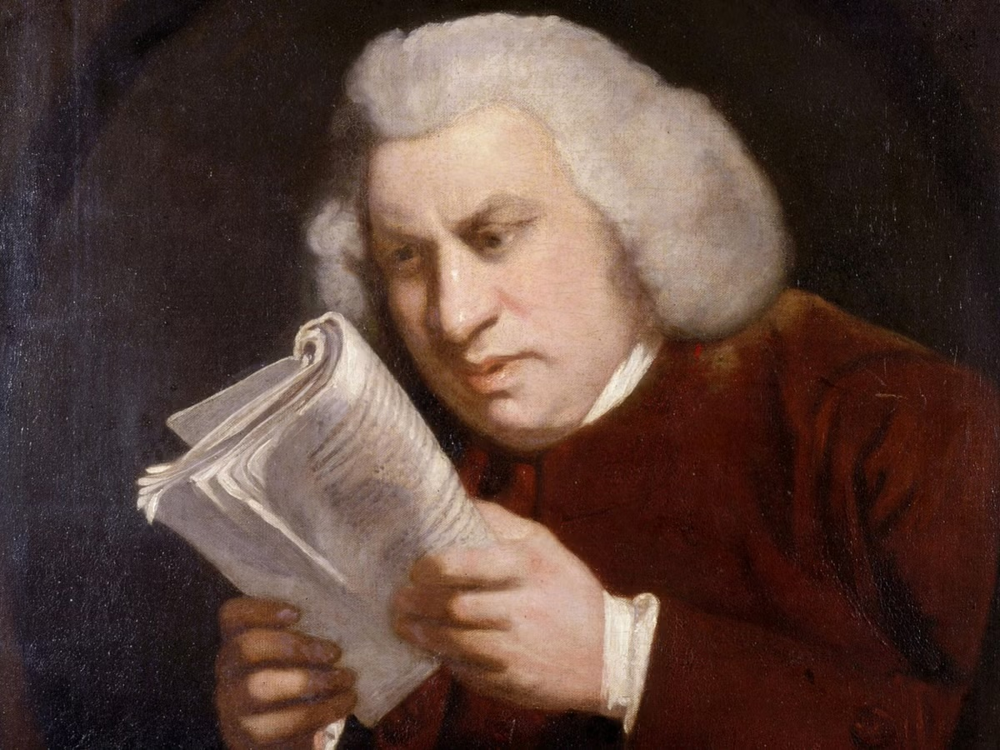

# squinter
*a small utility for comparing near-exact text files at the level of individual characters, made by a philologist, for philologists or anyone else* 

Squinter takes the strain out of comparing near-exact versions of text with long or otherwise difficult-to-read segments, by helping identify what actually needs attention and freeing you to ignore the rest. Its basic unit is the newline-separated lines, so input files should be formatted accordingly. 


(English lexicographer Samuel Johnson, expert squinter)

# motivation
While comparing and merging two digitizations of a particular (Sanskrit) text containing very long words, I became tired of how BBEdit's "compare" function, which I otherwise like for merging files, does not distinguish differences below the level of individual words. I needed to know which individual characters differed, without being distracted by the rest of the line. 

# screenshot

Squinter is above, in the browser, 
Preview is open in the middle with the PDF image, 
and BBEdit is open below. 
Modifications are done in BBEdit.

# example usage
```bash
python app.py --use-local-mode \
--local-filepath1 "/Users/tneill/Dropbox/Docs/Projects/Computational/Digitizations/bāṇa_kādambarī/5_merge/2_Tylers_new.txt" \
--local-filepath2 "/Users/tneill/Dropbox/Docs/Projects/Computational/Digitizations/bāṇa_kādambarī/5_merge/1_Andrew_derived.txt" \
--start-percentage 9 \
--end-percentage 20
```

